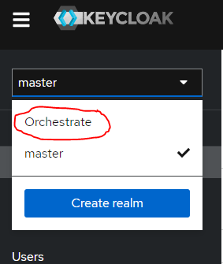

# Organization app

A web application with several features that would facilitate the organization
of music events and concerts. It would be an application with login (several
different levels of rights), adding, removing, and editing employees,
individual concerts, associated companies, staff, and temporary positions...

The main function would be for part-time workers. It would be a logging of hours
worked (the part-time worker would choose a given month, a given event, and a
given day the event took place and log how much he worked in that position) then
the application would calculate the price he should get (including taxes).

The application would include a frontend (the website itself) and a backend that
will take care of all the logic and database, possibly the actual deployment to
the domain and server. Optional extensions were the ability to add, remove, and
the ability to view event schedules where instructions would be listed for
employees.

## Project Deployment
**Contact Person** - Matej Vavrek (Discord: .swiftfeather)

To deploy the project, you must first prepare a ``.env`` file.
The example of a ``.env`` file can be found in ``.env.example``.

For some of the values, even though they would not be used on a real production
server, they can be kept as is.  The values that must be changed are
``KEYCLOAK_PUBKEY``, ``CLIENT_SECRET``, ``KEYCLOAK_ADMIN``,
``KEYCLOAK_ADMIN_PASSWORD``, ``KEYCLOAK_DB_USER``, ``KEYCLOAK_DB_PASSWORD``
and ``KEYCLOAK_DB_URL``.

To start the docker compose, you need to set, ``KEYCLOAK_ADMIN``,
``KEYCLOAK_ADMIN_PASSWORD``, ``KEYCLOAK_DB_USER``, ``KEYCLOAK_DB_PASSWORD`` and
``KEYCLOAK_DB_URL``. Set these to whatever you like, but be mindful that in
``KEYCLOAK_DB_URL``, you must only change the parts that contain
KEYCLOAK_DB_USER_HERE:KEYCLOAK_DB_PASSWORD_HERE to the user and password chosen
for the keycloak db.

Now, you can start the docker compose and it should start working.

To start the project up, you must have docker on your machine.
The command to start the project is:
```bash
docker compose up --build
```
However, for keycloak authentization to work, you will need to perform
additional steps. 

Once the keycloak container is fully intialized, it should load up the realm
(tenant) for the application.  Log into the keycloak application on
http://localhost:9090/ and open the administration console.  You will be
prompted for a login, input KEYCLOAK_ADMIN and KEYCLOAK_ADMIN_PASSWORD and log
in.

You should be shown the keycloak admin console interface. On the left side,
beneath the Keycloak logo, there is a selection element. Select Orchestrate.




From here, we need to extract the client secret.
<TODO>

## Authors 
* Bc. Petr Kadlec - czFire
* Slavomír Vlček - s_vlc
* Bc. Matej Vavrek - Swiftfeather
* Michal Šoltis - jumpman23

## Work Done
### Database Design - ERD
The database design was one of the first steps we took towards achieving our
results.

The database was modelled as an ERD diagram in plant UML, and can be found in
/design. This should be an up-to-date version.

Most of it was performed by Slavomír and Matej. Matej provided the base for the
ERD, and Slavomír did a lot of work on further elaboration, ensuring the
database model was consistent and logical in its design.

### Frontend Design The first designs of the frontend side of the project were
done in figma. These were done by Matej.  During frontend development, some of
the designs have changed significantly, so currently, this design is outdated.

You can find the early designs
[here](https://www.figma.com/file/TdkpVqSw8VvE8rMivkN2xl/Orchestrate---Rust-App?type=design&node-id=74%3A1472&mode=design&t=zWLYTI86JcVkAUde-1).

### API Design
The first draft of the API design was done by Matej in Swagger. You can find it
in /design.  This is an outdated version, as towards the end of development,
many endpoints changed or were removed and there was no time to update it.

### Containerization
Most of the containerization work was performed by Michal and Petr. Michal
provided the orchestration for the website, pgadmin and postgres containers, and
Petr added onto the orchestration with Keycloak and its accompanying database.

### Database SQL
Work on the Database SQL was done by Michal, Matej and Slavomir, but mostly by
Slavomir who ensured the SQL was consistent with the ERD, and added important
triggers and constraints.  Slavomir was also responsible for the seeding script,
and added most data to it.

### Database Repository Pattern
For database access, we had chosen SQLX as everyone worked with it due to the
iteration. Most of the work on the repository pattern was done by Petr, who
implemented access for all tables except for Timesheet and Wage Preset.

Petr also implemented most of the tests for the repositories.

The timesheet repository was first developed by Michal, but he was not up to the
task and Matej picked it up after him, who also defined the tests for the
timesheet repository.  The Wage Preset repository was developed Slavomir, who
also defined tests for this repository.

### Wage Calculation
Wage calculation was developed by Slavomir, who created everything necessary for
this component, including the Wage Preset table, the Wage Preset repository and
tests for this functionality.

### File Upload
As part of our website, we have decided to allow users to upload simple .jpg
images for their profiles, their companies and their events.  This component was
developed by Matej.

The component itself is rather simple and performs basic checks for file size
and file format. In a proper production environment, these files would likely be
stored elsewhere, such as a separate storage server.

### REST API
The majority of the REST API was developed by Matej. We used actix web to handle
requests and actix_web_files to handle serving of static files for the frontend.

### Frontend
Frontend was developed by Matej. The implementation was done in HTMX and we used
Tailwind CSS for styling.  The frontend is likely the second weakest part of the
application, as not everything is implemented as nicely as we would like. This
was due to time constraints because of the failure to provide Auth on time.

### Auth
The final developed component is Auth. It was first assigned to Michal, but he
was unable to implement this component and stopped working on it towards the end
of the project.  It was picked up by Petr and Matej, who tried to implement this
feature for the project deadline.

For implementation, we chose Keycloak, as it was relatively simple to setup and
work with.